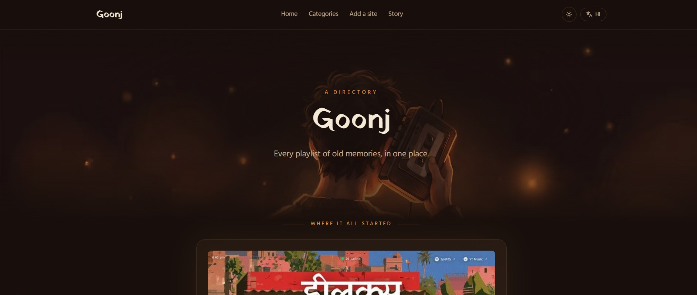

<div align="center">

# Goonj (गूँज)

**One place for every nostalgic Indian playlist site.**

[Live Demo](https://goonj.wtf) · [Add Your Site](#add-your-playlist-site) · [Getting Started](#getting-started)




</div>

---

## 📻 The trend

A while back, [@ybhrdwj](https://x.com/ybhrdwj) built [saloon.wtf](https://saloon.wtf) - a single-page playlist of the 90s Bollywood songs that play at Indian barbershops, styled like an old radio. It went viral for exactly the right reason: everyone has a version of that memory. So the internet started building its own - a Haryana Roadways bus playlist, a Punjabi wedding baraat playlist, a Chhath Puja playlist, a "grandparents' living room" playlist. Dozens of tiny, single-purpose sites, each built around one specific, nostalgic musical moment.

**Goonj - गूँज, "echo" - is where all of them live together.**

It doesn't host any music. It's a directory: every card here links out to the original site, credited to whoever built it. Think of it as the index that the trend never had.

## ✨ Features

- **69 curated sites** across 9 categories - road trips, weddings, festivals, school days, late-night drives, and more
- **A real page for every entry and every category** - not one big client-rendered blob. Full `sitemap.xml`, `hreflang`, JSON-LD structured data
- **Hindi ⇄ English**, fully routed (`/hi/...`, `/en/...`) and localized - not just a translated label bolted onto one page
- **Light and dark themes**, remembered across visits
- **A cassette-tape visual identity** - original design, no code or assets shared with the sites it indexes
- **Add your own site in one PR** - see below

## 🎵 Add your playlist site

Built something in this spirit - a barbershop station, a bus-stand mixtape, a festival playlist? Add it.

1. Fork this repo
2. Add an entry to [`data/entries.json`](./data/entries.json):

   ```json
   {
     "id": 70,
     "slug": "your-site-slug",
     "title": "Your Site Name",
     "title_en": null,
     "desc": "One line, in your own voice",
     "owner": "@yourhandle",
     "url": "https://your-site.com",
     "domain": "your-site.com",
     "category": "safar",
     "status": "live",
     "featured": false,
     "pinned": false,
     "views": null,
     "image": "/images/entries/your-site-slug.jpg"
   }
   ```

3. Drop a screenshot at `public/images/entries/your-site-slug.jpg` (or leave `image` as `null` to use the placeholder card)
4. Open a PR - no code changes needed, `category` just has to match one of the slugs already in the `categories` array in that same file

The same steps are also written out on the live [`/submit`](https://goonj.wtf/submit) page.

## 🚀 Getting started

*Requires Node.js 20+*

```bash
git clone https://github.com/wandering-phantom-0/Goonj.git
cd Goonj
npm install
cp .env.example .env.local
npm run dev
```

Open [localhost:3000](http://localhost:3000) - you'll land on `/hi`, the default locale. Switch language and theme from the header.

```bash
npm run build   # production build
```

## 📁 Project structure

```
goonj/
├─ data/entries.json       # every directory entry + category - the whole dataset
├─ messages/{hi,en}.json   # UI translations
├─ public/images/entries/  # site screenshots
└─ src/
   ├─ app/[locale]/        # pages - home, category, playlist, submit, about
   ├─ components/          # Header, EntryCard, ThemeToggle, LanguageSwitcher, ...
   ├─ i18n/                # next-intl routing config
   └─ lib/data.ts          # typed data-access layer
```

## 🛠️ Tech stack


Plus [next-intl](https://next-intl.dev) for i18n routing, [next-themes](https://github.com/pacocoursey/next-themes) for light/dark mode, [lucide-react](https://lucide.dev) for icons, and `next/og` for the generated favicon and OG images.

## 🖼️ Content & image attribution

`data/entries.json` is sourced directly from the original directory's own listing, not guessed or hand-typed - 68 community entries plus the original `saloon.wtf` listing, 69 total across 9 categories.

Screenshot thumbnails under `public/images/entries/` are previews of the linked third-party sites, shown here for identification purposes the same way any directory does - they weren't captured by this project and **aren't covered by the MIT license below**. If you're a site owner and want yours removed or swapped, or you're forking this and want to sidestep the question entirely: replace the file (same filename = same slug) or set that entry's `"image"` to `null`. No code changes needed either way.

## 🗺️ Roadmap

- [ ] Real submission form (currently PR-only, by design - keeps this on a free tier with no backend)
- [ ] Localized (Hindi) OG images - currently Latin-only, needs a bundled Devanagari font
- [ ] Client-side search
- [ ] More sites - [add yours](#add-your-playlist-site)

## 📄 License

Code is MIT-licensed - see [`LICENSE`](./LICENSE). Screenshot images are excluded from that grant (see [Content & image attribution](#content--image-attribution)).

## 🙏 Acknowledgments

Every site linked from Goonj belongs to its own creator, credited on its card. The trend itself started with [@ybhrdwj](https://x.com/ybhrdwj)'s [saloon.wtf](https://saloon.wtf) - this project just tries to keep all of it findable in one place.

Questions, new sites to add, or just want to say hi - [@wandering_phant](https://x.com/wandering_phant) on X.
